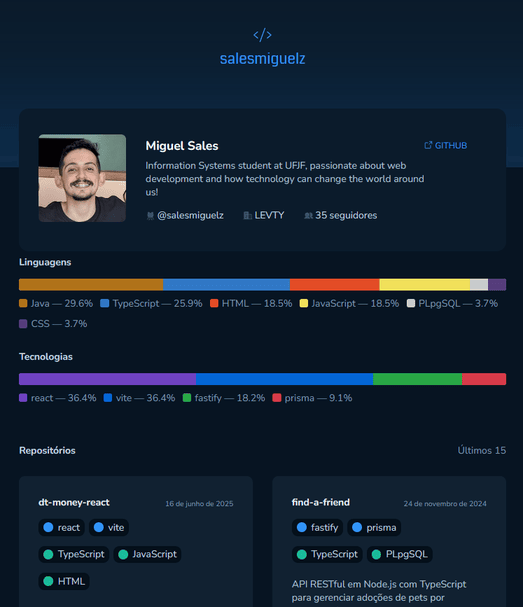

# resume

---
Oi!

Esta é uma aplicação fullstack com frontend em React, TypeScript e Vite, e backend em Node.js usando Fastify, que gera portfólios dinâmicos a partir de perfis do GitHub! O backend integra a API do GitHub para listar repositórios, extrair linguagens e tecnologias principais, e apresenta um relatório das ferramentas mais usadas pelo usuário.

Você pode clonar o repositório ou acessar a aplicação [aqui](https://resumebr.vercel.app).

## Como rodar localmente

- `npm install` para instalar as dependências  
- `npm run dev` para rodar o backend em modo desenvolvimento  
- Configure a variável de ambiente `GITHUB_TOKEN` com seu token pessoal do GitHub  
- Para rodar o frontend React, entre na pasta do frontend e rode `npm run dev` (usando Vite)  

## Tecnologias Utilizadas

### Frontend

- **React + TypeScript + Vite**: Contrução da aplicação front-end.  
- **Axios**: Requisições ao backend.  
- **React Router DOM**: Gerenciamento de rotas e navegação no app React.  
- **Styled-components**: Estilização dos componentes.  
- **Date-fns**: Manipulação e formatação de datas.  
- **Phosphor-react**: Ícones no app React.  

### Backend

- **Node.js**: Construção da aplicação back-end.  
- **Fastify**: Criação da API Restful.  
- **Axios**: Requisições à API do GitHub.  
- **dotenv**: Carregamento das variáveis de ambiente a partir do arquivo `.env`.  

## Misc

Esse projeto foi desenvolvido para criar uma solução simples e dinâmica para portfólios a partir do GitHub, focando em usabilidade e facilidade de deploy. Seu design foi baseado em um Figma disponibilizado como um dos desafios da trilha de React da @rocketseat.
